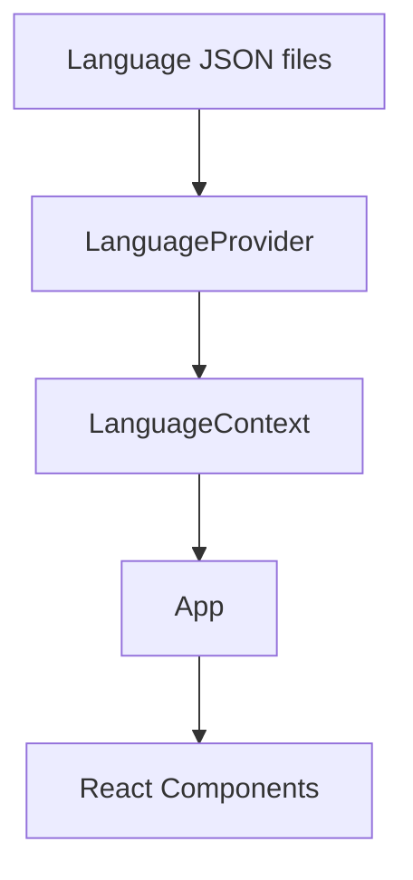

# Developer Portfolio

Personal developer portfolio built with **React, TypeScript, and Vite**.

The project was created to present my professional profile, technical skills, experience, and personal projects in a simple and maintainable website.

🌐 **Live Portfolio:**  
https://ivan-usheff.github.io/ivan-usheff/

---

## 👋 About the Project

I originally created this portfolio as a way to present my experience and projects when applying for software development positions.

Instead of building the website with all personal information hardcoded directly into the React components, I decided to structure it as a configurable application.

Content such as my professional description, projects, skills, contact information, links, and UI translations is stored separately from the presentation components.

This makes the project easier to maintain and allows the same structure to be reused or adapted without modifying most of the application code.

---

## ✨ Features

- Responsive personal portfolio
- Light and dark themes
- Multi-language support
- Dynamic language discovery
- Custom language selector with country flags
- Configurable personal information
- Downloadable CV
- Project showcase
- Technical skills section
- Contact and social links
- Project-specific technical documentation
- Persistent user preferences using local storage
- Automated tests with Vitest and React Testing Library
- GitHub Pages deployment

---

## 🌎 Internationalization

The portfolio includes a custom internationalization system implemented with:

- React Context
- Providers
- Reducer
- Custom hooks
- Dynamic JSON imports

Each supported language is defined in:

```text
src/config/languages/
```

For example:

```text
languages.es.json
languages.en.json
```

Each file contains the complete content required to render the portfolio in that language.

A simplified language configuration looks like:

```json
{
  "code": "en",
  "label": "English",
  "flag": "gb",
  "content": {
    "hero": {},
    "about": {},
    "skills": [],
    "projects": {},
    "contact": {}
  }
}
```

The application dynamically discovers the available language files instead of requiring every language to be manually imported.

---

## 🔄 Language Flow



When the user selects another language, the context updates the active configuration and React automatically re-renders the application with the corresponding content.

---

## 🧩 Configurable Content

One of the main goals of the project was to keep personal information separated from the UI components.

The language configuration contains information such as:

```text
Hero
├── Name
├── Professional role
├── Description
├── CV
└── Links

About
└── Professional background

Skills
└── Technologies

Projects
├── Type
├── Technologies
├── Description
└── Links

Contact
└── Social and contact links
```

This means components remain primarily responsible for presentation instead of containing portfolio-specific information.

---

## 🌓 Theme Support

The application supports both:

- Light mode
- Dark mode

The selected theme is persisted locally so the user's preference can be preserved between visits.

The theme selector is integrated into the navigation bar together with the language selector.

---

## 📂 Project Structure

```text
src/
├── assets/
│
├── components/
│   ├── dropdowns/
│   ├── about.tsx
│   ├── contact.tsx
│   ├── footer.tsx
│   ├── hero.tsx
│   ├── navbar.tsx
│   ├── projects.tsx
│   └── skills.tsx
│
├── config/
│   ├── languages/
│   │   ├── languages.en.json
│   │   └── languages.es.json
│   │
│   └── readme/
│
├── types/
│
├── utils/
│   └── context/
│       └── language/
│           ├── language.context.tsx
│           ├── language.hook.ts
│           ├── language.provider.tsx
│           └── language.reducer.ts
│
├── App.tsx
├── main.tsx
└── styles.css

tests/
├── components/
├── config/
├── context/
├── App.test.tsx
└── setup.ts
```

---

## 🧪 Testing

The project includes automated tests using:

- Vitest
- React Testing Library
- Testing Library User Event
- Jest DOM
- jsdom

The test suite covers both individual components and application behavior.

Some of the tested scenarios include:

- Language configuration consistency
- Language file discovery
- `LANGUAGE_LABELS` validation
- Language switching
- Language persistence
- Language reducer behavior
- Language Provider and Context
- Custom language dropdown
- Country flag rendering
- Navigation
- Theme behavior
- Portfolio sections
- Full application integration

The language tests also work as a contract between the declared languages and the actual configuration files.

For example, if a language is declared but its corresponding:

```text
languages.<code>.json
```

file does not exist, the test suite will fail.

Run all tests:

```bash
npm test
```

Run tests in watch mode:

```bash
npm run test:watch
```

---

## 🗂️ Featured Projects

The portfolio currently includes projects related to backend development, microservices, reusable libraries, and game development. :contentReference[oaicite:1]{index=1}

### Config Service

Centralized configuration service developed for a microservice-based architecture.

**Technologies:**

- NestJS
- TypeScript
- PostgreSQL
- TypeORM
- Docker

The service centralizes infrastructure configuration such as ports, database connections, secrets, and communication parameters used by other services.

---

### Company BFF

Backend for Frontend responsible for providing an API layer between client applications and internal microservices.

**Technologies and concepts:**

- NestJS
- TypeScript
- REST APIs
- TCP microservices
- JWT
- WebSockets
- Socket.IO
- RxJS

---

### MTO Common Library

Reusable NestJS library created to share infrastructure and contracts across multiple applications.

It includes functionality related to:

- Centralized configuration
- Base repositories
- Caching
- Logging
- AES encryption
- DTOs
- Types
- Entities
- Guards
- Custom decorators

---

### RPG 2D

Personal 2D RPG project developed with Python and Pygame.

The project is focused on applying concepts such as:

- Object-oriented programming
- Game loops
- Software architecture
- Game state management

---

## 🛠️ Technologies

### Frontend

- React
- TypeScript
- Vite
- HTML
- CSS

### Testing

- Vitest
- React Testing Library
- Jest DOM
- jsdom

### Tooling

- Git
- GitHub
- GitHub Pages
- npm

---

## 🚀 Running Locally

Clone the repository:

```bash
git clone https://github.com/Ivan-Usheff/ivan-usheff.git
```

Enter the project directory:

```bash
cd ivan-usheff
```

Install dependencies:

```bash
npm install
```

Start the development server:

```bash
npm run dev
```

Vite will start the application locally.

---

## 📦 Build

Generate a production build:

```bash
npm run build
```

The compiled application will be generated inside:

```text
dist/
```

Preview the production build locally:

```bash
npm run preview
```

---

## 🌐 Deployment

The portfolio is deployed using **GitHub Pages**.

Production version:

https://ivan-usheff.github.io/ivan-usheff/

The project uses Vite's base configuration to ensure static assets and routes work correctly when the application is served from the repository subpath.

---

## ➕ Adding a New Language

The language system was designed to make adding translations straightforward.

For example, to add German:

```text
src/config/languages/languages.de.json
```

The file must follow the same structure as the existing language configurations.

The language must also be declared in the application's supported language definitions.

The automated tests verify that:

```text
LANGUAGE_LABELS
        ↕
languages.<code>.json
```

remain synchronized.

This helps prevent incomplete or incorrectly configured translations from reaching production.

---

## 🧠 Concepts Applied

This project allowed me to work with and reinforce concepts related to:

- React component architecture
- TypeScript type modeling
- React Context API
- Reducers and Providers
- Custom React hooks
- State management
- Dynamic module imports
- Configuration-driven applications
- Internationalization
- Responsive design
- Theme management
- Local storage
- Component testing
- Integration testing
- Separation of concerns
- GitHub Pages deployment

---

## 📌 Project Status

**Stable version available.**

The current version includes the main functionality planned for the portfolio:

- Professional presentation
- Project showcase
- Multi-language support
- Light and dark themes
- Configurable content
- Responsive interface
- Automated testing
- GitHub Pages deployment

The project may continue receiving improvements as new projects, technologies, and professional experience are added.

---

## 👤 Author

**Ivan Usheff**

Backend / Full Stack Developer focused on backend applications, APIs, system integrations, and microservice-based architectures. :contentReference[oaicite:2]{index=2}

- GitHub: https://github.com/Ivan-Usheff
- LinkedIn: https://www.linkedin.com/in/ivan-usheff
- Portfolio: https://ivan-usheff.github.io/ivan-usheff/