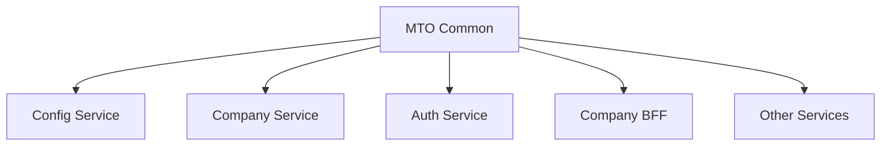

# MTO Common Library

Shared library developed with **NestJS and TypeScript** to centralize reusable components, contracts, and functionality across different services in a microservice-based architecture.

The library provides common modules and abstractions for configuration, data access, caching, logging, security, validation, entities, and DTO definitions.

## 📖 Project Background

As my personal project grew and incorporated new microservices and BFFs, several implementations started being repeated across applications.

Features such as logging, configuration, encryption, data access, DTOs, entities, guards, and decorators had to be implemented or maintained across multiple projects.

To reduce this duplication, I developed **MTO Common**, a shared library that centralizes these responsibilities and allows them to be reused by the different components of the architecture.

This helps maintain consistent behavior across services while centralizing infrastructure-related changes.

## 🎯 Objective

The main objective of the library is to provide reusable components for the NestJS projects within the architecture.

Its responsibilities include:

- Sharing DTOs, types, and entities
- Centralizing infrastructure utilities
- Providing access to the centralized configuration service
- Standardizing logging across applications
- Providing encryption utilities
- Reusing common repository logic
- Providing caching mechanisms
- Sharing guards and decorators
- Reducing duplicated code across microservices and BFFs

## 🏗️ Architecture

The library is divided into modules according to the responsibility of each component:

```text
src/
├── base/
├── cache/
├── config-consumer/
├── decorators/
├── dto/
├── encript/
├── entities/
├── enum/
├── errors/
├── guard/
├── logger/
├── suscriber/
├── typeorm/
├── types/
├── utils/
└── index.ts
```

The main entry point exports the different modules so they can be consumed by other applications:

```ts
export * from "./base";
export * from "./cache";
export * from "./config-consumer";
export * from "./decorators";
export * from "./dto";
export * from "./encript/encript";
export * from "./entities";
export * from "./enum";
export * from "./guard";
export * from "./logger";
export * from "./typeorm";
export * from "./types";
export * from "./utils";
```

## ⚙️ Centralized Configuration

The library includes `CustomConfigService`, which is responsible for retrieving application configuration from an external configuration service.

Each application can identify itself using variables such as:

```text
APP_NAME
SERVER_ENV
CONFIG_SERVICE
```

The currently supported environments are:

```text
DEV
STG
QA
PRE
PROD
```

Once the configuration is retrieved, the library provides methods for accessing information such as:

- Host
- Port
- Databases
- Secrets
- Commands
- Microservices
- Complete service configuration

For example:

```ts
configService.getPORT();

configService.getHOST();

configService.getDBs();

configService.getDB("database-name");

configService.getMicroservices();

configService.getMicroservice("SERVICE");

configService.getMicroserviceCMD(
  "SERVICE",
  "COMMAND"
);
```

This allows consuming services to remain independent from the way external configuration is retrieved and structured.

## 🔐 AES Encryption

The library includes `AESEncrypt`, a reusable service for encrypting and decrypting information.

Cryptographic configuration is obtained through `CustomConfigService`, including:

```text
AES_ALGORITHM
AES_PRIVATE_KEY
AES_IV
inputEncoding
outputEncoding
```

The service validates the configured keys and provides operations for both strings and objects.

```ts
encrypt(text);

decrypt(text);

encryptObj(object);

decryptObj<T>(encryptedObject);
```

This makes it possible to reuse the same encryption mechanism across the different components consuming the library.

## 🗄️ Base Repository

`BaseRepository` provides a generic abstraction over TypeORM repositories.

It includes common operations such as:

```text
getAll
findBy
repoFindBy
findOneBy
findOne
findOneWithQuery
createOne
createMany
update
```

The implementation uses generics:

```ts
BaseRepository<E>
```

allowing repositories for different entities to extend the base implementation without duplicating common data-access operations.

It also integrates the library's caching system to reuse previously retrieved data.

## ⚡ Cache

`CacheService<T>` provides a generic abstraction over the NestJS caching system.

It currently supports operations such as:

```text
setData
getData
getOneFromData
addToData
updateOneOnData
```

The service uses generics to operate on different entity types and can be consumed by repositories or other components.

```text
Repository
    │
    ▼
CacheService
    │
    ├── Cache hit ──► return data
    │
    └── Cache miss
            │
            ▼
        Repository
            │
            ▼
         Database
```

## 📝 Logging

The library implements `CustomLogger`, based on NestJS `ConsoleLogger`.

The logger adds contextual information to messages, including:

- Service name
- Process PID
- Timestamp
- Message level
- Context
- Time difference between messages

Different log levels are supported:

```text
LOG
WARN
ERROR
DEBUG
FATAL
```

Each level also uses a different console representation to improve log readability during development.

## 🧩 Custom Decorators

The library contains reusable decorators for different application layers.

These include:

```text
HandlerController
HandlerService
HandlerRepository
PublicKey
IsImageFile
IsTypeOf
ValidationType
```

These decorators help encapsulate common behavior and validation logic, reducing duplicated code across controllers, services, and repositories.

## 🛡️ Guards

The library includes reusable components related to authentication and authorization.

These components make it possible to share security-related logic between the different applications that form part of the architecture.

## 📦 Shared DTOs and Types

One of the main purposes of the library is to maintain common contracts between services.

It includes DTOs related to:

- Users
- Profiles
- Companies
- Addresses
- Actions
- Models
- Inputs
- Comments
- Procedures
- Administration

It also contains the corresponding TypeScript types for these structures.

This allows different services to use compatible contracts without redefining them individually.

## 🗃️ Shared Entities

The library contains TypeORM entities used by different components of the architecture.

These include entities related to:

- Users
- Profiles
- Companies
- Addresses
- Actions
- Models
- Payments
- Comments
- Service configuration
- Databases
- Secrets
- BFFs
- Commands

It also includes a base entity used to share common properties across models.

## 🔄 Relationship With Other Projects

MTO Common works as a shared dependency within the architecture:



This allows common functionality to be maintained in a single project and reused by multiple services.

## 🛠️ Technologies

- Node.js
- TypeScript
- NestJS
- TypeORM
- PostgreSQL
- RxJS
- Axios
- NestJS Config
- NestJS Cache Manager
- NestJS JWT
- Swagger / OpenAPI
- class-validator
- class-transformer

## 📦 Build

Install dependencies:

```bash
npm install
```

Build the library:

```bash
npm run build
```

The library exposes its modules through its main entry point:

```text
dist/index.js
```

## 🧪 Testing

The project is configured to use Jest.

Run tests:

```bash
npm run test
```

Run tests in watch mode:

```bash
npm run test:watch
```

Generate a coverage report:

```bash
npm run test:cov
```

## 🧠 Concepts Applied

This project allowed me to work with and deepen my knowledge of:

- Reusable library development
- Microservice-based architectures
- Separation of responsibilities
- Dependency Injection
- TypeScript Generics
- Repository Pattern
- TypeORM
- Caching
- Centralized configuration
- AES encryption
- Custom logging
- Custom decorators
- DTOs and validation
- Shared contracts between services
- NestJS modularization
- Code reuse

## 📌 Status

Personal project currently under development and used as a shared library by other components of the architecture.

The current implementation centralizes different infrastructure responsibilities and common contracts, helping reduce duplicated code and maintain consistent behavior across services.

The project continues to evolve as new shared requirements emerge across the different components of the architecture.