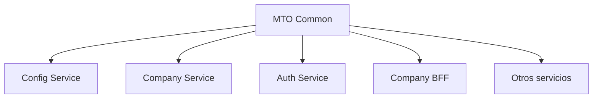

# MTO Common Library

Librería compartida desarrollada con **NestJS y TypeScript** para centralizar componentes, contratos y funcionalidades reutilizables entre los diferentes servicios de una arquitectura basada en microservicios.

La librería proporciona módulos y abstracciones comunes para configuración, acceso a datos, caché, logging, seguridad, validación y definición de entidades y DTOs.

## 📖 Origen del proyecto

A medida que mi proyecto personal fue creciendo e incorporando nuevos microservicios y BFFs, comenzaron a repetirse distintas implementaciones entre aplicaciones.

Funcionalidades como logging, configuración, encriptación, acceso a datos, DTOs, entidades, guards y decoradores debían implementarse o mantenerse en múltiples proyectos.

Para reducir esta duplicación desarrollé **MTO Common**, una librería compartida que concentra estas responsabilidades y permite reutilizarlas desde los diferentes componentes de la arquitectura.

Esto permite mantener criterios comunes entre servicios y centralizar cambios relacionados con infraestructura.

## 🎯 Objetivo

El principal objetivo de la librería es proporcionar componentes reutilizables para los proyectos NestJS de la arquitectura.

Entre sus responsabilidades se encuentran:

- Compartir DTOs, tipos y entidades
- Centralizar utilidades de infraestructura
- Proporcionar acceso al servicio centralizado de configuración
- Estandarizar logging entre aplicaciones
- Proporcionar utilidades de encriptación
- Reutilizar lógica común de repositories
- Proporcionar mecanismos de caché
- Compartir guards y decoradores
- Reducir código duplicado entre microservicios y BFFs

## 🏗️ Arquitectura

La librería se encuentra dividida en módulos según la responsabilidad de cada componente:

```text
src/
├── base/
├── cache/
├── config-consumer/
├── decorators/
├── dto/
├── encript/
├── entities/
├── enum/
├── errors/
├── guard/
├── logger/
├── suscriber/
├── typeorm/
├── types/
├── utils/
└── index.ts
```

El archivo principal exporta los diferentes módulos para que puedan ser utilizados desde las aplicaciones consumidoras:

```ts
export * from "./base";
export * from "./cache";
export * from "./config-consumer";
export * from "./decorators";
export * from "./dto";
export * from "./encript/encript";
export * from "./entities";
export * from "./enum";
export * from "./guard";
export * from "./logger";
export * from "./typeorm";
export * from "./types";
export * from "./utils";
```

## ⚙️ Configuración centralizada

La librería incluye `CustomConfigService`, encargado de consumir configuraciones desde un servicio externo de configuración.

Cada aplicación puede identificarse mediante variables como:

```text
APP_NAME
SERVER_ENV
CONFIG_SERVICE
```

Los ambientes contemplados actualmente son:

```text
DEV
STG
QA
PRE
PROD
```

Una vez obtenida la configuración, la librería proporciona métodos para acceder a información como:

- Host
- Puerto
- Bases de datos
- Secrets
- Comandos
- Microservicios
- Configuración completa del servicio

Por ejemplo:

```ts
configService.getPORT();

configService.getHOST();

configService.getDBs();

configService.getDB("database-name");

configService.getMicroservices();

configService.getMicroservice("SERVICE");

configService.getMicroserviceCMD(
  "SERVICE",
  "COMMAND"
);
```

Esto permite que los servicios consumidores no necesiten conocer directamente cómo se obtiene o estructura la configuración externa.

## 🔐 Encriptación AES

La librería incorpora `AESEncrypt`, un servicio reutilizable para encriptar y desencriptar información.

La configuración criptográfica se obtiene desde `CustomConfigService`, incluyendo:

```text
AES_ALGORITHM
AES_PRIVATE_KEY
AES_IV
inputEncoding
outputEncoding
```

El servicio valida las claves y proporciona operaciones para strings y objetos.

```ts
encrypt(text);

decrypt(text);

encryptObj(object);

decryptObj<T>(encryptedObject);
```

Esto permite reutilizar el mismo mecanismo de encriptación entre los distintos componentes que consumen la librería.

## 🗄️ Base Repository

`BaseRepository` proporciona una abstracción genérica sobre repositories de TypeORM.

Incluye operaciones comunes como:

```text
getAll
findBy
repoFindBy
findOneBy
findOne
findOneWithQuery
createOne
createMany
update
```

La implementación utiliza genéricos:

```ts
BaseRepository<E>
```

permitiendo extender el repository para diferentes entidades sin repetir las operaciones comunes de acceso a datos.

También integra el sistema de caché de la librería para reutilizar datos previamente consultados.

## ⚡ Caché

`CacheService<T>` proporciona una abstracción genérica sobre el sistema de caché de NestJS.

Actualmente permite operaciones como:

```text
setData
getData
getOneFromData
addToData
updateOneOnData
```

El servicio utiliza genéricos para trabajar con diferentes tipos de entidades y puede ser utilizado por repositories u otros componentes.

```text
Repository
    │
    ▼
CacheService
    │
    ├── Cache hit ──► devuelve datos
    │
    └── Cache miss
            │
            ▼
        Repository
            │
            ▼
         Database
```

## 📝 Logging

La librería implementa `CustomLogger`, basado en `ConsoleLogger` de NestJS.

El logger agrega información contextual a los mensajes, incluyendo:

- Nombre del servicio
- PID del proceso
- Timestamp
- Nivel del mensaje
- Contexto
- Diferencia temporal entre mensajes

Se contemplan diferentes niveles:

```text
LOG
WARN
ERROR
DEBUG
FATAL
```

Además, cada nivel utiliza una representación visual diferenciada en consola para facilitar la lectura de logs durante el desarrollo.

## 🧩 Decoradores personalizados

La librería contiene decoradores reutilizables para distintas capas de la aplicación.

Entre ellos:

```text
HandlerController
HandlerService
HandlerRepository
PublicKey
IsImageFile
IsTypeOf
ValidationType
```

Estos decoradores permiten encapsular comportamientos y validaciones comunes evitando repetir lógica entre controllers, services y repositories.

## 🛡️ Guards

La librería incluye componentes reutilizables relacionados con autenticación y autorización.

Estos elementos permiten compartir lógica de seguridad entre las diferentes aplicaciones que forman parte de la arquitectura.

## 📦 DTOs y tipos compartidos

Uno de los objetivos principales de la librería es mantener contratos comunes entre servicios.

Incluye DTOs relacionados con:

- Usuarios
- Perfiles
- Empresas
- Direcciones
- Acciones
- Modelos
- Inputs
- Comentarios
- Trámites
- Administración

También contiene tipos TypeScript asociados a estas estructuras.

Esto permite que diferentes servicios utilicen contratos compatibles sin redefinirlos individualmente.

## 🗃️ Entidades compartidas

La librería contiene entidades TypeORM utilizadas por distintos componentes de la arquitectura.

Entre ellas existen entidades relacionadas con:

- Usuarios
- Perfiles
- Empresas
- Direcciones
- Acciones
- Modelos
- Pagos
- Comentarios
- Configuración de servicios
- Bases de datos
- Secrets
- BFFs
- Comandos

También incluye una entidad base utilizada para compartir propiedades comunes entre modelos.

## 🔄 Relación con otros proyectos

MTO Common funciona como una dependencia compartida dentro de la arquitectura:



De esta manera, funcionalidades comunes pueden mantenerse en un único proyecto y reutilizarse desde diferentes servicios.

## 🛠️ Tecnologías

- Node.js
- TypeScript
- NestJS
- TypeORM
- PostgreSQL
- RxJS
- Axios
- NestJS Config
- NestJS Cache Manager
- NestJS JWT
- Swagger / OpenAPI
- class-validator
- class-transformer

## 📦 Compilación

Instalar dependencias:

```bash
npm install
```

Compilar la librería:

```bash
npm run build
```

La librería expone sus módulos a través del archivo principal:

```text
dist/index.js
```

## 🧪 Tests

El proyecto se encuentra configurado para utilizar Jest.

Ejecutar tests:

```bash
npm run test
```

Ejecutar tests en modo watch:

```bash
npm run test:watch
```

Generar reporte de cobertura:

```bash
npm run test:cov
```

## 🧠 Conceptos aplicados

Este proyecto me permitió trabajar y profundizar conocimientos relacionados con:

- Desarrollo de librerías reutilizables
- Arquitecturas basadas en microservicios
- Separación de responsabilidades
- Dependency Injection
- Generic Types en TypeScript
- Repository Pattern
- TypeORM
- Caché
- Configuración centralizada
- Encriptación AES
- Logging personalizado
- Decoradores personalizados
- DTOs y validación
- Contratos compartidos entre servicios
- Modularización con NestJS
- Reutilización de código

## 📌 Estado

Proyecto personal actualmente en desarrollo y utilizado como librería compartida por otros componentes de la arquitectura.

La implementación actual centraliza diferentes responsabilidades de infraestructura y contratos comunes, permitiendo reducir código duplicado y mantener un comportamiento consistente entre los servicios.

El proyecto continúa evolucionando a medida que se incorporan nuevas necesidades compartidas entre los diferentes componentes de la arquitectura.