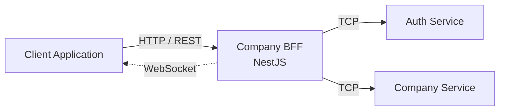
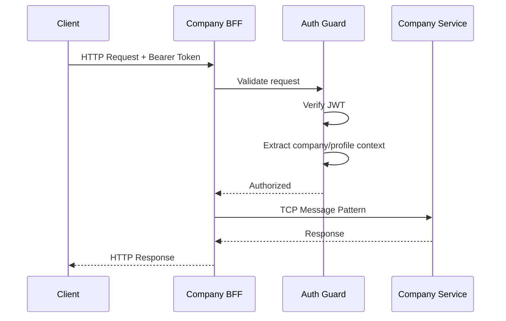
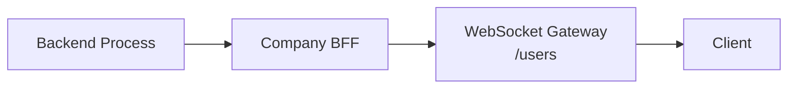

# Company BFF

Backend for Frontend developed with **NestJS and TypeScript**, designed to provide a dedicated API layer between client applications and the backend microservices of a company management platform.

The service centralizes authentication, request validation, company context resolution and communication with internal microservices.

## 📖 Project Background

As the architecture of my personal project grew into multiple frontend applications and backend microservices, I needed an intermediate layer responsible for exposing APIs tailored to each client while keeping the internal services isolated from direct frontend access.

To address this, I developed **Company BFF**, a Backend for Frontend responsible for receiving HTTP requests from company-facing applications, validating the authenticated session and forwarding operations to the appropriate internal microservices.

This allows frontend applications to interact with a single API while the BFF handles service communication, authentication context and infrastructure concerns.

## 🎯 Objective

The main responsibilities of Company BFF are:

- Provide a dedicated API for company-facing applications
- Act as a gateway between clients and internal microservices
- Validate authentication using JWT
- Extract company and user context from authenticated sessions
- Forward requests to backend services through TCP
- Centralize validation and error handling
- Support real-time communication through WebSockets
- Consume centralized application configuration

## 🏗️ Architecture

The application follows a modular NestJS architecture.



The frontend does not communicate directly with the internal microservices.

Instead, Company BFF acts as the entry point and coordinates communication with the services required to process each request.

## 🔄 Request Flow

A typical authenticated request follows this flow:



This keeps authentication and client-specific concerns inside the BFF while the internal services remain focused on their business responsibilities.

## 🔐 Authentication

The project implements a global NestJS authentication guard.

Protected requests are expected to provide a JWT using the standard Bearer authentication scheme:

```text
Authorization: Bearer <token>
```

The guard:

1. Detects endpoints marked as public.
2. Extracts the JWT from the Authorization header.
3. Validates the token.
4. Decrypts the authenticated profile information.
5. Adds contextual information to the request.

The resulting request context includes information such as:

```text
company
profileId
actions
data
```

Controllers can then use this information without requiring the client to repeatedly provide company or profile identifiers.

The authentication layer also contains logic for handling expired sessions and requesting token renewal through the authentication service.

## 🔌 Microservice Communication

Company BFF communicates with internal services using the NestJS Microservices package and **TCP transport**.

Two main clients are currently configured:

```text
Company BFF
   │
   ├── AUTH-SERVICE
   │
   └── COMPANY-SERVICE
```

Communication is performed using message patterns.

For example:

```text
COMPANY_USERS_READ_PATTERN
COMPANY_USERS_CREATE_PATTERN

COMPANY_INPUTS_READ_PATTERN
COMPANY_INPUTS_CREATE_PATTERN

COMPANY_MODELS_READ_PATTERN
COMPANY_MODEL_READ_PATTERN
COMPANY_MODELS_CREATE_PATTERN

AUTH_COMPANIES_READ_LOGIN_PATTERN
AUTH_COMPANIES_UPDATE_TOKEN_PATTERN
```

This allows the HTTP API exposed by the BFF to remain decoupled from the transport used by the internal services.

## 👥 Users Module

The Users module exposes company-scoped user operations.

Available responsibilities include:

- Retrieve company users
- Retrieve a specific user
- Create users
- Retrieve available user actions

The authenticated company identifier is extracted from the request context and forwarded to the Company Service.

Example flow:

```text
GET /api/company/users
        │
        ▼
Company BFF
        │
        │ COMPANY_USERS_READ_PATTERN
        ▼
Company Service
```

## 🧩 Models Module

The Models module provides operations related to dynamic models and their associated inputs and fieldsets.

Implemented operations include:

- Retrieve available inputs
- Create inputs
- Retrieve fieldsets
- Retrieve models
- Retrieve a specific model
- Create models
- Model update communication

The BFF forwards these operations to Company Service using dedicated TCP message patterns.

## 🔄 WebSockets

The project also includes WebSocket support using **Socket.IO** and NestJS WebSocket gateways.

A dedicated users namespace is available:

```text
/users
```

The gateway currently handles client connection and disconnection events and provides the foundation for asynchronous notifications between backend processes and frontend applications.



## ⚙️ Centralized Configuration

Company BFF integrates with the reusable `mto-common` library and its `CustomConfigService`.

Application configuration is retrieved during bootstrap before the HTTP server starts.

The configuration service is used for values such as:

- Application port
- JWT configuration
- Security parameters
- Microservice configuration

This allows infrastructure configuration to remain separated from the application business logic.

## 📦 Shared Library

The project consumes a custom reusable library:

```text
mto-common
```

The library contains shared functionality used across the architecture, including components such as:

- Custom configuration services
- Logging
- Cache utilities
- AES encryption
- Shared DTOs and types
- Authentication structures
- Controller/service decorators
- Common exception handling

This avoids duplicating infrastructure code between services.

## 🛡️ Validation

A global NestJS `ValidationPipe` is configured with:

```text
whitelist: true
forbidNonWhitelisted: true
implicit conversion: enabled
```

This ensures incoming payloads are validated against their DTO definitions and unexpected properties are rejected.

## 📚 API Documentation

The application uses **Swagger / OpenAPI** to generate API documentation.

After starting the application, Swagger is exposed at:

```text
/api
```

The Company API itself uses the global prefix:

```text
/api/company
```

## 📂 Project Structure

```text
src/
├── common/
│   ├── auth/
│   │   ├── dto/
│   │   ├── auth.controller.ts
│   │   ├── auth.module.ts
│   │   └── auth.service.ts
│   │
│   ├── config/
│   │   ├── decorators/
│   │   ├── auth.config.ts
│   │   ├── clients.config.ts
│   │   ├── guard.config.ts
│   │   ├── jwt.config.ts
│   │   └── register.config.ts
│   │
│   ├── models/
│   │   ├── dtos/
│   │   ├── models.controller.ts
│   │   ├── models.module.ts
│   │   └── models.service.ts
│   │
│   └── users/
│       ├── user.socket.ts
│       ├── users.controller.ts
│       ├── users.module.ts
│       └── users.service.ts
│
├── app.controller.ts
├── app.module.ts
├── app.service.ts
└── main.ts
```

## 🛠️ Technologies

- Node.js
- TypeScript
- NestJS
- NestJS Microservices
- TCP Transport
- REST APIs
- JWT
- Socket.IO
- WebSockets
- RxJS
- Swagger / OpenAPI
- class-validator
- Custom shared libraries

## 🚀 Running the Project

Install dependencies:

```bash
npm install
```

Run in development mode:

```bash
npm run start:dev
```

Build:

```bash
npm run build
```

Run in production mode:

```bash
npm run start:prod
```

## 🧪 Testing

Run unit tests:

```bash
npm run test
```

Run end-to-end tests:

```bash
npm run test:e2e
```

Generate test coverage:

```bash
npm run test:cov
```

## 🧠 Concepts Applied

This project allowed me to work with and deepen my knowledge of:

- Backend for Frontend architecture
- Microservice architectures
- NestJS dependency injection
- TCP communication between services
- Message-based communication
- JWT authentication
- Authentication guards
- Request context propagation
- REST API design
- WebSockets and Socket.IO
- RxJS Observables
- DTO validation
- Dependency separation
- Shared library development
- Centralized configuration
- Custom decorators
- API documentation with Swagger

## 📌 Status

Personal project currently under development.

The current implementation provides the foundation for the company-facing BFF, including authentication, user management, dynamic model operations, microservice communication and WebSocket support.

Future development will continue expanding the available business operations and real-time communication between the frontend and backend services.