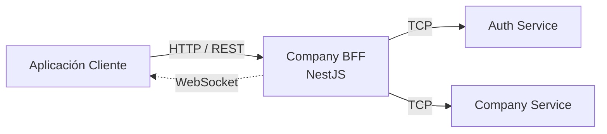
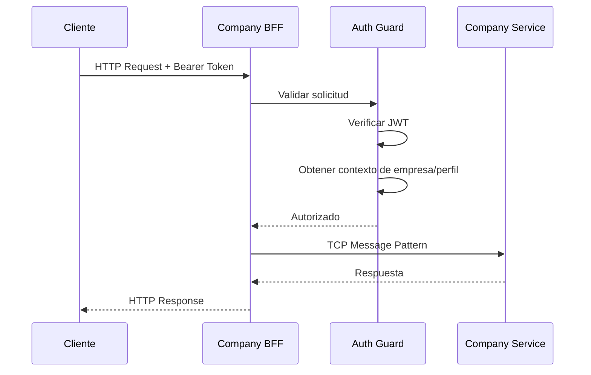
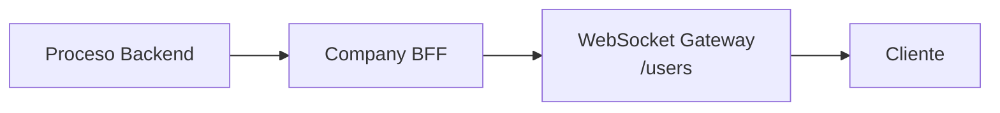

# Company BFF

Backend for Frontend desarrollado con **NestJS y TypeScript**, diseñado para proporcionar una capa de API dedicada entre las aplicaciones cliente y los microservicios backend de una plataforma de gestión empresarial.

El servicio centraliza la autenticación, validación de solicitudes, resolución del contexto de empresa y comunicación con los microservicios internos.

## 📖 Origen del proyecto

A medida que la arquitectura de mi proyecto personal fue creciendo e incorporando múltiples aplicaciones frontend y microservicios backend, surgió la necesidad de contar con una capa intermedia encargada de exponer APIs adaptadas a cada cliente, evitando al mismo tiempo el acceso directo del frontend a los servicios internos.

Para resolver esta necesidad desarrollé **Company BFF**, un Backend for Frontend encargado de recibir las solicitudes HTTP provenientes de las aplicaciones orientadas a empresas, validar la sesión autenticada y redirigir las operaciones hacia los microservicios internos correspondientes.

De esta manera, las aplicaciones frontend pueden interactuar con una única API mientras el BFF se encarga de la comunicación entre servicios, el contexto de autenticación y otros aspectos de infraestructura.

## 🎯 Objetivo

Las principales responsabilidades de Company BFF son:

- Proporcionar una API dedicada para las aplicaciones orientadas a empresas
- Actuar como gateway entre los clientes y los microservicios internos
- Validar la autenticación mediante JWT
- Obtener el contexto de empresa y usuario desde la sesión autenticada
- Redirigir solicitudes hacia servicios backend mediante TCP
- Centralizar validaciones y manejo de errores
- Proporcionar soporte para comunicación en tiempo real mediante WebSockets
- Consumir configuración centralizada de la aplicación

## 🏗️ Arquitectura

La aplicación utiliza una arquitectura modular basada en NestJS.



El frontend no se comunica directamente con los microservicios internos.

En su lugar, Company BFF funciona como punto de entrada y coordina la comunicación con los servicios necesarios para procesar cada solicitud.

## 🔄 Flujo de una solicitud

Una solicitud autenticada típica sigue el siguiente flujo:



Esto permite mantener dentro del BFF las responsabilidades relacionadas con autenticación y necesidades específicas del cliente, mientras que los servicios internos permanecen enfocados en su lógica de negocio.

## 🔐 Autenticación

El proyecto implementa un guard global de autenticación utilizando NestJS.

Las solicitudes protegidas deben proporcionar un JWT utilizando el esquema estándar Bearer:

```text
Authorization: Bearer <token>
```

El guard se encarga de:

1. Detectar endpoints marcados como públicos.
2. Extraer el JWT desde el header `Authorization`.
3. Validar el token.
4. Desencriptar la información del perfil autenticado.
5. Agregar información de contexto a la solicitud.

El contexto resultante contiene información como:

```text
company
profileId
actions
data
```

Los controllers pueden utilizar posteriormente esta información sin necesidad de que el cliente envíe repetidamente los identificadores de empresa o perfil.

La capa de autenticación también contiene lógica para gestionar sesiones expiradas y solicitar la renovación del token mediante el servicio de autenticación.

## 🔌 Comunicación con microservicios

Company BFF se comunica con los servicios internos utilizando **NestJS Microservices** y transporte **TCP**.

Actualmente se configuran dos clientes principales:

```text
Company BFF
   │
   ├── AUTH-SERVICE
   │
   └── COMPANY-SERVICE
```

La comunicación se realiza mediante patrones de mensajes.

Por ejemplo:

```text
COMPANY_USERS_READ_PATTERN
COMPANY_USERS_CREATE_PATTERN

COMPANY_INPUTS_READ_PATTERN
COMPANY_INPUTS_CREATE_PATTERN

COMPANY_MODELS_READ_PATTERN
COMPANY_MODEL_READ_PATTERN
COMPANY_MODELS_CREATE_PATTERN

AUTH_COMPANIES_READ_LOGIN_PATTERN
AUTH_COMPANIES_UPDATE_TOKEN_PATTERN
```

Esto permite mantener desacoplada la API HTTP expuesta por el BFF del mecanismo de transporte utilizado por los servicios internos.

## 👥 Módulo de usuarios

El módulo `Users` expone operaciones relacionadas con los usuarios pertenecientes a una empresa.

Entre sus responsabilidades se encuentran:

- Obtener los usuarios de una empresa
- Obtener un usuario específico
- Crear usuarios
- Obtener las acciones disponibles para los usuarios

El identificador de empresa autenticado se obtiene desde el contexto de la solicitud y posteriormente se envía al Company Service.

Ejemplo:

```text
GET /api/company/users
        │
        ▼
Company BFF
        │
        │ COMPANY_USERS_READ_PATTERN
        ▼
Company Service
```

## 🧩 Módulo de modelos

El módulo `Models` proporciona operaciones relacionadas con modelos dinámicos y sus correspondientes inputs y fieldsets.

Entre las operaciones implementadas se encuentran:

- Obtener inputs disponibles
- Crear inputs
- Obtener fieldsets
- Obtener modelos
- Obtener un modelo específico
- Crear modelos
- Comunicación para actualización de modelos

El BFF redirige estas operaciones hacia Company Service utilizando patrones TCP específicos para cada operación.

## 🔄 WebSockets

El proyecto también incorpora soporte para WebSockets utilizando **Socket.IO** y los gateways de NestJS.

Actualmente existe un namespace dedicado a usuarios:

```text
/users
```

El gateway gestiona actualmente eventos de conexión y desconexión de clientes y proporciona la base para implementar notificaciones asíncronas entre procesos backend y aplicaciones frontend.



## ⚙️ Configuración centralizada

Company BFF integra la librería reutilizable `mto-common` y su `CustomConfigService`.

La configuración de la aplicación se obtiene durante el proceso de bootstrap, antes de iniciar el servidor HTTP.

El servicio de configuración proporciona valores relacionados con:

- Puerto de la aplicación
- Configuración JWT
- Parámetros de seguridad
- Configuración de microservicios

Esto permite mantener la configuración de infraestructura separada de la lógica propia de la aplicación.

## 📦 Librería compartida

El proyecto utiliza una librería reutilizable propia:

```text
mto-common
```

Esta librería contiene funcionalidades compartidas entre los diferentes componentes de la arquitectura, incluyendo:

- Servicios de configuración personalizados
- Logging
- Utilidades de caché
- Encriptación AES
- DTOs y tipos compartidos
- Estructuras relacionadas con autenticación
- Decoradores para controllers y services
- Manejo común de excepciones

Esto permite evitar la duplicación de código de infraestructura entre los distintos servicios.

## 🛡️ Validación

La aplicación utiliza globalmente `ValidationPipe` de NestJS con configuraciones orientadas a validar y restringir los datos recibidos.

Entre ellas:

```text
whitelist: true
forbidNonWhitelisted: true
implicit conversion: enabled
```

De esta manera, los payloads recibidos son validados contra sus DTOs y las propiedades no esperadas pueden ser rechazadas.

## 📚 Documentación de la API

La aplicación utiliza **Swagger / OpenAPI** para generar documentación de sus endpoints.

Una vez iniciada la aplicación, la documentación Swagger se encuentra disponible en:

```text
/api
```

La API correspondiente a Company utiliza además el prefijo global:

```text
/api/company
```

## 📂 Estructura del proyecto

```text
src/
├── common/
│   ├── auth/
│   │   ├── dto/
│   │   ├── auth.controller.ts
│   │   ├── auth.module.ts
│   │   └── auth.service.ts
│   │
│   ├── config/
│   │   ├── decorators/
│   │   ├── auth.config.ts
│   │   ├── clients.config.ts
│   │   ├── guard.config.ts
│   │   ├── jwt.config.ts
│   │   └── register.config.ts
│   │
│   ├── models/
│   │   ├── dtos/
│   │   ├── models.controller.ts
│   │   ├── models.module.ts
│   │   └── models.service.ts
│   │
│   └── users/
│       ├── user.socket.ts
│       ├── users.controller.ts
│       ├── users.module.ts
│       └── users.service.ts
│
├── app.controller.ts
├── app.module.ts
├── app.service.ts
└── main.ts
```

## 🛠️ Tecnologías

- Node.js
- TypeScript
- NestJS
- NestJS Microservices
- TCP Transport
- REST APIs
- JWT
- Socket.IO
- WebSockets
- RxJS
- Swagger / OpenAPI
- class-validator
- Librerías compartidas propias

## 🚀 Ejecución del proyecto

Instalar dependencias:

```bash
npm install
```

Ejecutar en modo desarrollo:

```bash
npm run start:dev
```

Compilar el proyecto:

```bash
npm run build
```

Ejecutar en producción:

```bash
npm run start:prod
```

## 🧪 Tests

Ejecutar tests unitarios:

```bash
npm run test
```

Ejecutar tests end-to-end:

```bash
npm run test:e2e
```

Generar reporte de cobertura:

```bash
npm run test:cov
```

## 🧠 Conceptos aplicados

Este proyecto me permitió trabajar y profundizar conocimientos relacionados con:

- Arquitectura Backend for Frontend
- Arquitecturas basadas en microservicios
- Inyección de dependencias con NestJS
- Comunicación TCP entre servicios
- Comunicación mediante patrones de mensajes
- Autenticación mediante JWT
- Guards de autenticación
- Propagación del contexto de una solicitud
- Diseño de APIs REST
- WebSockets y Socket.IO
- Observables con RxJS
- Validación mediante DTOs
- Separación de responsabilidades
- Desarrollo de librerías compartidas
- Configuración centralizada
- Decoradores personalizados
- Documentación de APIs con Swagger

## 📌 Estado

Proyecto personal actualmente en desarrollo.

La implementación actual proporciona la base del BFF orientado a empresas, incluyendo autenticación, gestión de usuarios, operaciones sobre modelos dinámicos, comunicación con microservicios y soporte inicial para WebSockets.

El desarrollo continuará incorporando nuevas operaciones de negocio y ampliando la comunicación en tiempo real entre las aplicaciones frontend y los servicios backend.