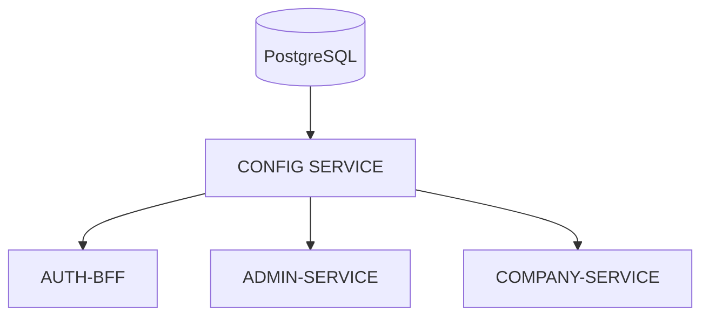

# Config Service

Centralized configuration service for microservice-based architectures, developed with NestJS, TypeScript, and PostgreSQL.

## 📖 Project Background

Config Service was created to address a need I encountered while developing a personal project composed of multiple microservices.

As the project grew, each service needed to maintain its own configuration, including ports, database connections, credentials, secrets, and communication parameters for interacting with other services.

Many of these configurations were duplicated across applications and had to be maintained manually.

To solve this problem, I developed Config Service: a REST API responsible for centralizing these configurations and providing them dynamically based on the requested service and environment.


## 🎯 Objective

Centralize the configuration required to run the different components of a distributed architecture.

Each service can request its configuration using its name and environment, avoiding duplicated configuration across projects.


## ⚙️ What Does It Manage?

Config Service manages configuration related to:

- Backend services
- BFFs (Backend For Frontend)
- Database connections
- Ports and hosts
- Secrets and security parameters
- Patterns/commands used for communication between microservices


## 🏗️ Architecture

The service uses a modular architecture based on NestJS.

The application logic is divided into controllers, services, and repositories, separating data access responsibilities from business logic.


## 🔄 General Flow

A service requests its configuration:




## 🛠️ Technologies

- Node.js
- TypeScript
- NestJS
- PostgreSQL
- TypeORM
- Swagger / OpenAPI
- Docker
- Docker Compose
- class-validator


## 📂 Structure


## 📚 API

The project uses Swagger to document the available endpoints.

Once the service is running, the API documentation can be accessed at:

```text
http://localhost:<PORT>/api
```


## 🐳 Docker

The project includes:

- Dockerfile
- docker-compose.yml

This allows the service and its dependencies to run inside containers.


## 🚀 Running the Project

Install dependencies:

```bash
npm install
```

Run in development mode:

```bash
npm run start:dev
```

Build the project:

```bash
npm run build
```

Run in production mode:

```bash
npm run start:prod
```


## 🧠 Concepts Applied

This project allowed me to work with and deepen my knowledge of:

- Modular architecture with NestJS
- Centralized configuration management
- Microservice-based architectures
- Repository Pattern
- Dependency Injection
- DTOs and validation
- TypeORM
- REST API design
- API documentation with Swagger
- Docker containers
- Reusable library development


## 📌 Status

Personal project currently under development.

I am continuing to work on improvements related to dynamic configuration, service registration, and communication between the different components of the architecture.