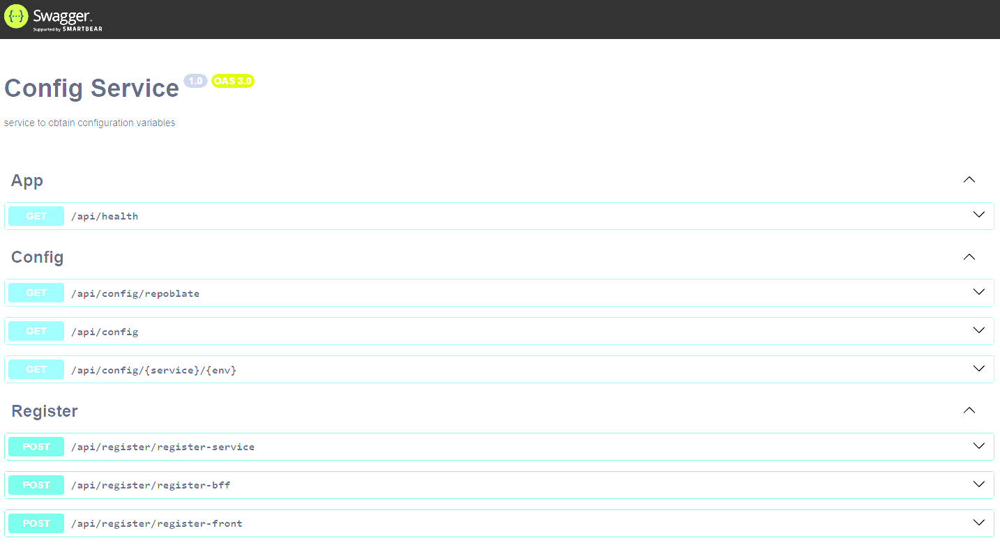
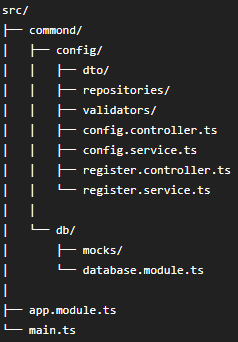

# Config Service

Servicio centralizado de configuración para arquitecturas basadas en
microservicios, desarrollado con NestJS, TypeScript y PostgreSQL.

## 📖 Origen del proyecto

Config Service nació a partir de una necesidad que encontré mientras
desarrollaba un proyecto personal compuesto por múltiples microservicios.

A medida que el proyecto crecía, cada servicio necesitaba mantener su
propia configuración: puertos, conexiones a bases de datos, credenciales,
secretos y parámetros de comunicación con otros servicios.

Muchas de estas configuraciones se repetían entre aplicaciones y debían
mantenerse manualmente.

Para resolver este problema desarrollé Config Service: una API REST
encargada de centralizar las configuraciones y entregarlas dinámicamente
según el servicio y el ambiente solicitado.

## 🎯 Objetivo

Centralizar la configuración necesaria para levantar los distintos
componentes de una arquitectura distribuida.

Cada servicio puede solicitar su configuración utilizando su nombre y
ambiente, evitando mantener configuraciones duplicadas entre proyectos.

## ⚙️ ¿Qué información administra?

Config Service permite administrar configuraciones relacionadas con:

- Servicios backend
- BFF (Backend For Frontend)
- Conexiones a bases de datos
- Puertos y hosts
- Secretos y parámetros de seguridad
- Patrones/comandos utilizados para comunicación entre microservicios

## 🏗️ Arquitectura

El servicio utiliza una arquitectura modular basada en NestJS.

La lógica está dividida en controllers, services y repositories,
separando las responsabilidades de acceso a datos y lógica de negocio.

## 🔄 Flujo general

Un servicio solicita su configuración:

Service A
    |
    | GET /api/config/...
    v
Config Service
    |
    v
PostgreSQL
    |
    | Service configuration
    v
Config Service
    |
    v
Service A

## 🛠️ Tecnologías

- Node.js
- TypeScript
- NestJS
- PostgreSQL
- TypeORM
- Swagger / OpenAPI
- Docker
- Docker Compose
- class-validator

## 📂 Estructura

## 📚 API

El proyecto utiliza Swagger para documentar los endpoints disponibles.

Una vez iniciado el servicio, la documentación puede consultarse desde:

http://localhost:<PORT>/api

## 🐳 Docker

El proyecto incluye:

- Dockerfile
- docker-compose.yml

Esto permite ejecutar el servicio y sus dependencias dentro de
contenedores.

## 🚀 Ejecución

Instalar dependencias:

npm install

Ejecutar en desarrollo:

npm run start:dev

Compilar:

npm run build

Ejecutar producción:

npm run start:prod

## 🧠 Conceptos aplicados

Este proyecto me permitió trabajar y profundizar en:

- Arquitectura modular con NestJS
- Centralización de configuración
- Arquitecturas basadas en microservicios
- Repository Pattern
- Dependency Injection
- DTOs y validaciones
- TypeORM
- Diseño de APIs REST
- Documentación con Swagger
- Contenedores Docker
- Desarrollo de librerías reutilizables

## 📌 Estado

Proyecto personal en desarrollo.

Actualmente continúo trabajando en mejoras relacionadas con
configuración dinámica, registro de servicios y comunicación entre
los distintos componentes de la arquitectura.